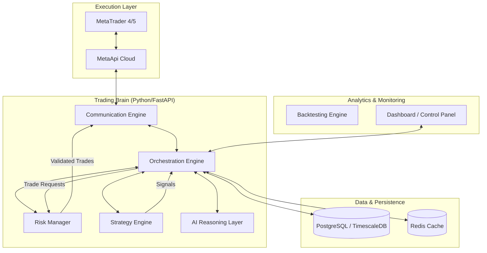

# Project Asta: Comprehensive System Architecture & Design

## 1. System Overview & Architecture

Project Asta is an institutional-grade, AI-assisted automated trading infrastructure. The system follows **Clean Architecture** principles to ensure modularity, testability, and long-term maintainability.

### High-Level Architecture Diagram (Logical)



### Service Boundaries

- **Execution Service**: Responsible for low-level broker communication via MetaApi. It handles order placement, modification, and real-time position synchronization.
- **Trading Brain**: The central hub that coordinates strategies, risk management, and AI reasoning. It maintains the global state of the portfolio.
- **Strategy Engine**: A plugin-based system where multiple strategies can run in parallel, each producing signals with confidence scores.
- **Risk Management Engine**: The "final filter" for all trades. It validates every trade against account-wide and strategy-specific risk parameters.
- **AI Reasoning Layer**: Augments strategy signals with market regime classification, sentiment analysis, and LLM-based reasoning.
- **Analytics Service**: Computes real-time and historical performance metrics (Sharpe, Drawdown, etc.).

---

## 2. Tech Stack

- **Backend**: Python 3.11+
- **Web Framework**: FastAPI (Async-first)
- **MT Connectivity**: MetaApi Cloud SDK
- **Database**: 
    - **PostgreSQL**: Relational data (trades, settings, users).
    - **TimescaleDB**: Extension for high-performance OHLCV and tick data storage.
    - **Redis**: Real-time state caching, rate limiting, and pub/sub.
- **Task Scheduling**: APScheduler (in-process) and Celery (distributed tasks).
- **Data Validation**: Pydantic v2
- **ORM**: SQLAlchemy 2.0 (Async)
- **AI/ML**: 
    - Google Gemini API (Reasoning)
    - Scikit-learn / XGBoost (Regime Detection)
    - Pandas / NumPy (Technical Analysis)
- **Frontend**: React, TypeScript, Tailwind CSS, TradingView Lightweight Charts.
- **DevOps**: Docker, Docker Compose, GitHub Actions.

---

## 3. Folder Structure (Clean Architecture)

```text
project-asta/
├── src/
│   ├── asta_brain/
│   │   ├── api/                # FastAPI Routers & Endpoints
│   │   ├── core/
│   │   │   ├── domain/         # Entities (Trade, Account, Signal)
│   │   │   ├── use_cases/      # Business Logic (ExecuteTrade, SyncPositions)
│   │   │   └── interfaces/     # Repository & Service abstractions
│   │   ├── infrastructure/
│   │   │   ├── adapters/       # MetaApi, DB, Redis implementations
│   │   │   └── schemas/        # Pydantic models (Internal & External)
│   │   ├── strategies/         # Modular Strategy Plugins
│   │   ├── risk/               # Risk Management Engine
│   │   ├── ai/                 # AI Reasoning & ML Modules
│   │   └── main.py             # Application Entrypoint
│   ├── dashboard/              # React Frontend Application
│   └── shared/                 # Shared Python utilities
├── tests/
│   ├── unit/
│   ├── integration/
│   └── backtesting/
├── docker/
│   ├── backend.Dockerfile
│   ├── dashboard.Dockerfile
│   └── docker-compose.yml
├── docs/                       # Documentation & API Specs
├── .env.example
├── pyproject.toml
└── README.md
```

---

## 4. Core Module Definitions

### A. Strategy Engine (Plugin System)
Every strategy must implement the `BaseStrategy` interface:
```python
class BaseStrategy(ABC):
    @abstractmethod
    async def analyze(self, market_data: MarketData) -> List[Signal]:
        pass
```
Strategies are registered via a factory and can be enabled/weighted dynamically.

### B. Risk Management Engine
Filters every trade signal before execution:
- **Pre-trade checks**: Margin availability, Max exposure per pair, Max drawdown check.
- **Dynamic Sizing**: Kelly Criterion or Volatility-adjusted (ATR) position sizing.
- **Global Kill-switch**: Emergency stop if daily loss limit is hit.

### C. AI Reasoning Layer
- **Input**: Market data, technical indicators, news sentiment.
- **Output**: Confidence multiplier (0.0 to 1.0) and reasoning metadata.
- **Logic**: Uses LLMs to explain *why* a trade should or shouldn't be taken based on macro context.

---

## 5. API Design

### REST API (Internal & Dashboard)
- `GET /health`: System status.
- `GET /accounts`: List connected MT4/5 accounts.
- `GET /positions`: Active trades across all accounts.
- `POST /strategies/{id}/toggle`: Enable/disable a strategy.
- `GET /analytics/performance`: Sharpe ratio, equity curve data.

### WebSockets (Real-time)
- `ws/market-data`: Streamed OHLCV/Ticks.
- `ws/trade-events`: Notifications for execution, SL/TP hits.
- `ws/ai-reasoning`: Real-time AI analysis stream.

---

## 6. Database Schema (Conceptual)

- **`accounts`**: `id, broker, login, type (demo/live), balance, equity`
- **`trades`**: `id, account_id, symbol, side, volume, entry_price, sl, tp, status, strategy_id, open_time, close_time`
- **`signals`**: `id, strategy_id, symbol, action, confidence, ai_reasoning, timestamp`
- **`ohlcv_data`**: `time, symbol, timeframe, open, high, low, close, volume` (TimescaleDB Hypertable)
- **`audit_logs`**: `id, level, message, metadata, timestamp`

---

## 7. Communication Patterns

1. **Event-Driven Execution**:
    - MetaApi streams a price update -> Strategy Engine processes -> Signal generated -> Risk Engine validates -> MetaApi executes order.
2. **Async Polling/Heartbeat**:
    - Background task syncs account equity and positions every 30 seconds to ensure consistency.
3. **Pub/Sub for UI**:
    - All backend state changes are published to Redis, which then pushes to WebSocket clients.

---

## 8. Deployment & Infrastructure

- **Containerization**: Every service (Backend, Dashboard, DB, Redis) runs in Docker.
- **Networking**: Internal Docker network for service-to-service comms; Nginx as reverse proxy.
- **Persistence**: Volume mounts for PostgreSQL data and logs.
- **Scaling**: MetaApi allows horizontal scaling of accounts by running multiple "connections" via their cloud bridge.

---

## 9. CI/CD & Engineering Practices

- **Linting/Formatting**: `ruff`, `mypy` (strict typing).
- **Testing**: `pytest` with `pytest-asyncio`. Goal: >80% coverage on core/risk modules.
- **CI**: GitHub Actions to run tests, linting, and build Docker images.
- **Hardening**:
    - Circuit breakers for API calls.
    - Rate limiting on trade execution.
    - Structured logging (JSON) for easy ELK/Grafana integration.
    - Encrypted environment variables for API keys.

---

## 10. Implementation Roadmap

### Phase 1: Infrastructure (Weeks 1-2)
- [ ] Set up project structure and Docker environment.
- [ ] Implement MetaApi connection manager and basic execution bridge.
- [ ] Establish Database schema and migrations.
- [ ] Basic FastAPI skeleton with health checks.

### Phase 2: Core Brain & Strategy (Weeks 3-4)
- [ ] Strategy interface and first technical strategy (EMA/RSI).
- [ ] Risk Management Engine (Static sizing).
- [ ] Real-time position synchronization.

### Phase 3: AI & Analytics (Weeks 5-6)
- [ ] AI Reasoning Layer integration (Gemini API).
- [ ] Performance metrics calculation engine.
- [ ] Dashboard MVP (Live trades & Equity curve).

### Phase 4: Optimization & Backtesting (Weeks 7-8)
- [ ] Historical data ingestion pipeline.
- [ ] Backtesting engine for strategy validation.
- [ ] Parameter optimization tools.

### Phase 5: Production Hardening (Weeks 9+)
- [ ] Multi-account scaling.
- [ ] Advanced failover & monitoring.
- [ ] Security audits & performance tuning.
